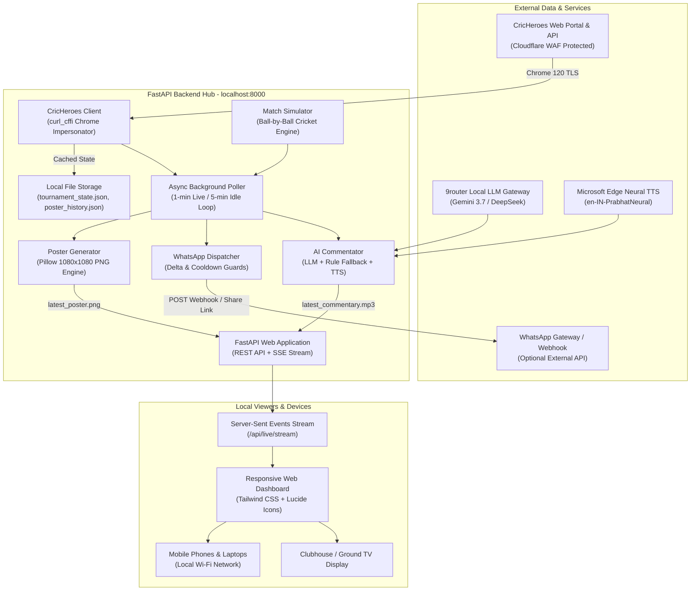

# VLV Ganapati Men's Cricket Tournament 2026
## Local Live Scoreboard, Poster Generator, AI Voice Commentator & WhatsApp Hub
### Comprehensive Project Documentation & Technical Architecture

---

## 1. Executive Summary & Objective

The **VLV Cricket Hub** (`CH_Score`) is an end-to-end, localized tournament operations and broadcasting system engineered for the **VLV Ganapati Men's Cricket Tournament 2026** (CricHeroes Tournament ID: `2169387`), held at Nimbalkar Sports Club, Lohegaon, Pune.

### Key Goals & Challenges Solved:
1. **Zero-Latency Local Viewing**: Rather than having dozens or hundreds of apartment residents refresh CricHeroes simultaneously (which causes throttling and IP rate limits), this application functions as a **polite, single-client caching bridge**. It polls CricHeroes once per configured interval and streams real-time updates to all connected local screens (laptops, mobile phones, big-screen TVs) via Server-Sent Events (SSE).
2. **Cloudflare WAF & Anti-Bot Bypass**: CricHeroes enforces strict Cloudflare Bot Management and TLS fingerprinting rules that return `HTTP 403 Forbidden` to standard HTTP libraries (`requests`, `urllib`, `aiohttp`). The system integrates `curl_cffi` to mimic Chrome 120 TLS fingerprints (JA3/JA4) and HTTP/2 handshakes, parsing Next.js 14 React Server Components (RSC) streams directly without slow headless browser overhead.
3. **Automated 1080x1080 Match Posters**: An automated Pillow (PIL) graphic pipeline produces crisp, high-resolution square scorecards ready for WhatsApp group updates, Instagram stories, and status feeds.
4. **Safe WhatsApp Dispatch Automation**: Equipped with strict anti-ban guardrails (Delta change detection, 50-second cooldown timers, over-end cadence) to prevent WhatsApp spam flags. Provides both 1-click pre-formatted WhatsApp share links and external webhook forwarding.
5. **AI Voice Commentary**: Leverages LLMs (Gemini / DeepSeek via local router) and Microsoft Edge Neural TTS (`en-IN-PrabhatNeural`) to generate realistic Indian-style broadcast audio commentary for every ball and over.
6. **Pre-Tournament Simulation Suite**: An integrated ball-by-ball match simulator allows tournament organizers to test and rehearse all dashboard widgets, poster generation, and dispatch routines before the tournament starts on September 26, 2026.

---

## 2. High-Level System Architecture



---

## 3. Detailed Component Breakdown

### 3.1. CricHeroes Client (`services/cricheroes_client.py`)
- **Impersonation Layer**: Uses `curl_cffi.requests` configured with `impersonate="chrome120"`. This generates valid Chrome TLS Client Hello extensions, cipher suites, elliptic curves, and HTTP/2 settings, completely bypassing Cloudflare WAF bot-challenge walls.
- **RSC Stream Parsing (`_get_page_rsc_chunks` & `_extract_json_block`)**: CricHeroes uses Next.js 14 App Router which transmits data through React Server Component chunks (`self.__next_f.push([1,"..."])`). The client extracts escaped RSC payloads and executes a bracket-balancing JSON parser to capture deep objects (`tournamentDetails`, `matches`, `teamResponse`, `scorecard`).
- **Live Match Endpoints**:
  - `fetch_tournament_info_and_matches()`: Extracts tournament metadata and the 9 upcoming fixture schedules.
  - `fetch_teams()`: Extracts all 6 participating teams and individual player rosters (names, IDs, profile image URLs).
  - `fetch_live_pune_matches()`: Queries CricHeroes geolocated API (`/api/v1/search/v2/near-by-me-matches/18.5204/73.8567`) to discover live matches in Pune.
  - `fetch_live_mini_scorecard(match_id)`: Fetches real-time ball-by-ball, batter, and bowler figures with an internal 25-second TTL cache to eliminate redundant network overhead.
  - `sync_all()`: Aggregates full tournament state and stores it atomically in `data/tournament_state.json`.

---

### 3.2. 1080x1080 Match Poster Generator (`services/poster_generator.py`)
Generates broadcast-quality graphics using Pillow (`PIL`).
- **Dimensions & Visual Styling**: Fixed 1080 × 1080 square canvas at 95% JPEG/PNG quality. Uses a dark slate aesthetic (`#0f172a`), rounded cards (`#1e293b`), gold highlights (`#facc15`), and cyan/rose contrast accents.
- **Graphic Elements Rendered**:
  1. **Top Header**: Pulsing "● LIVE" badge (or "● BREAK"), Tournament Title, Round, Overs Limit, and Ground Venue.
  2. **Primary Scorecard Box**: Team A vs Team B matchup, batting team tag, huge gold font (`Runs/Wickets`), overs bowled, Current Run Rate (CRR), Target, and Required Run Rate (RRR).
  3. **This Over Strip**: Individual delivery circles color-coded by event (Red for Wicket `W`, Green for Boundary `4`, Purple for Maximum `6`, Amber for Extras `wd`/`nb`, Slate for dot balls `0`).
  4. **Two-Column Stat Grid**:
     - *Batters at Crease*: Striker (`*`) and non-striker, runs scored, balls faced, boundaries (4s & 6s), and strike rate (SR).
     - *Current Bowler*: Bowler name, bowling figures in `O - M - R - W` format, and economy rate.
  5. **Match Equation Banner**: Prominent blue container displaying current match status (e.g. *"NEED 22 RUNS IN 14 BALLS TO WIN"* or toss result).
  6. **Footer Bar**: Automatic timestamp and system generation watermark.
- **Output Management**: Saves individual snapshots (`output/posters/poster_{match_id}_{overs}.png`) and overwrites `output/posters/latest_poster.png` for zero-latency web serving.

---

### 3.3. Safe WhatsApp Dispatcher (`services/whatsapp_dispatcher.py`)
Automates social broadcast updates while strictly protecting the sending number against anti-spam triggers:
- **Delta Check Guard**: Compares the current tuple `(runs, wickets, overs, status)` against the last dispatched state. If no delivery has occurred (e.g., timeout, injury break, drinks, innings switch), dispatch is skipped.
- **Cooldown Throttling**: Enforces a strict minimum of 50 seconds (`WHATSAPP_COOLDOWN_SECONDS = 50`) between any consecutive messages.
- **Cadence Rules**:
  - `1min_delta`: Runs every minute, but only dispatches if the score has genuinely progressed.
  - `over_end`: Only dispatches when an over finishes (e.g. `1.0`, `2.0`, `3.0`), providing clean, non-spammy periodic summaries.
- **Message Formatting**: Produces clean WhatsApp Markdown with emojis, team scores, batter/bowler figures, and match equations.
- **Dual Delivery Modes**:
  - *1-Click Web Link*: Generates pre-encoded `https://api.whatsapp.com/send?text=...` links for one-tap sharing by tournament admins directly from mobile or desktop.
  - *Webhook Dispatch*: If configured with an external WhatsApp gateway (Green-API, Evolution API, Baileys, etc.), it posts JSON payloads containing caption, poster path, and target group name.
- **Audit History**: All dispatch events and skipped checks are logged to `data/poster_history.json` and presented in the dashboard audit tab.

---

### 3.4. AI Voice Commentator (`services/ai_commentator.py`)
Provides dynamic, auditory broadcasting for spectators:
- **LLM Commentary Synthesis**:
  - Sends live scorecard state to the local 9router LLM gateway (`http://localhost:20128/v1/chat/completions`).
  - Prompts models (`gemini/gemini-3.7-flash` or `kimchi/deepseek-v4-flash-0731`) to adopt an energetic Indian cricket broadcasting persona (combining the styles of Ravi Shastri and Harsha Bhogle).
  - Constrained strictly to 2 punchy, high-octane sentences capturing the immediate context and pressure.
- **Deterministic Fallback Engine**: If the LLM router is unavailable, a built-in rule-based commentator analyzes match context (chasing targets, required run rates, recent boundaries/wickets) to generate engaging text.
- **Neural Speech Generation**:
  - Uses Microsoft `edge-tts` with the `en-IN-PrabhatNeural` voice (natural Indian English male neural voice).
  - Streams the synthesized audio directly to `output/commentary/latest_commentary.mp3`.
- **Dashboard Audio Player**: The web UI automatically loads the new audio snippet and features an "Auto-Speak" toggle for hands-free commentary streaming.

---

### 3.5. Interactive Match Simulator (`services/match_simulator.py`)
Built to facilitate testing, demonstration, and rehearsal prior to the official tournament commencement date:
- **Realistic Match Engine**:
  - Simulates an 8-over limited overs match between **F Wing** and **A Wing**.
  - Uses actual players from the CricHeroes roster (Biswajit Nath, Darshit Patel, Venkatesh Iyer, Manish Harne, etc.).
  - Configured with weighted probabilities realistic for tennis-ball / box cricket (dots: 25%, singles: 32%, twos: 12%, fours: 14%, sixes: 9%, wickets: 5%, wides: 3%).
- **Rules Fidelity**:
  - Rotates strike on odd runs (1s and 3s).
  - Replaces dismissed batters from the team squad list.
  - Switches strike and bowler at the end of each completed over.
  - Accurately tracks strike rates, economy rates, CRR, RRR, and match conclusions (win by wickets or runs).
- **Interactive Control**: Organizers can trigger `+1 Ball`, `+1 Over (6 balls)`, `Reset Match`, or enable `Auto-Step` (bowls one ball automatically every 15 seconds).

---

### 3.6. FastAPI Web Server & Background Tasks (`app.py`)
- **FastAPI Core**: Lightweight, asynchronous ASGI server running on `uvicorn`.
- **Server-Sent Events (`/api/live/stream`)**: Pushes match updates directly to open browser clients every 2 seconds without full HTTP polling.
- **Background Poller**: Continuous background `asyncio` loop running alongside the web server:
  - Selectively polls real CricHeroes live matches, tournament matches, or advances the simulator.
  - Automatically triggers poster generation and WhatsApp dispatch according to active settings.

---

### 3.7. Responsive Front-End Dashboard (`templates/index.html`, `static/`)
- **Theme & Tech**: Built with Tailwind CSS and Lucide icons in an ultra-modern dark theme (`slate-950`). Fully responsive across desktop, tablet, and mobile browsers.
- **Five Primary Views**:
  1. **Live Match Center**: Main live scoreboard, team matchup, real-time score display, CRR/RRR, over ball sequence, batters/bowler stats, AI voice commentary player, and real-time poster preview.
  2. **Upcoming Matches (9)**: Visual schedule of all 9 tournament matches with date/time, teams, overs, and venue.
  3. **Teams & Squads (6)**: Interactive squad browser for all 6 wings (A Wing, B Wing, C Wing, E Wing, F Wing, H Wing) with player profile photos and IDs.
  4. **Poster & WhatsApp Log**: Chronological audit table of generated posters, delta checks, and dispatch records.
  5. **Settings & Anti-Block**: Controls for auto-dispatch, cadence selection, webhook URL, group names, and anti-block system status.

---

## 4. Complete Directory Structure

```
d:\AI_stuff\CH_Score\
├── app.py                      # FastAPI web server, routes, SSE streaming, and background poller
├── config.py                   # Central settings (Tournament ID, polling intervals, paths)
├── run.bat                     # 1-click Windows launcher
├── README.md                   # Quick start summary
├── DOCUMENTATION.md            # Comprehensive project documentation
├── test_commentary.mp3         # Audio test artifact
├── services/
│   ├── __init__.py
│   ├── cricheroes_client.py    # Cloudflare WAF-bypassing scraper & CricHeroes API client
│   ├── poster_generator.py     # 1080x1080 high-res scorecard graphic generator (Pillow)
│   ├── match_simulator.py      # Ball-by-ball cricket simulator for rehearsal
│   ├── whatsapp_dispatcher.py  # WhatsApp dispatcher with delta check & anti-ban guards
│   └── ai_commentator.py       # AI broadcast commentary (LLM + Edge-TTS audio)
├── templates/
│   └── index.html              # Single-page responsive dark-theme dashboard UI
├── static/
│   ├── css/
│   │   └── styles.css          # Custom styling, scrollbars, and pulsing animations
│   └── js/
│       └── dashboard.js        # SSE live streaming, tab routing, audio controls, and UI updates
├── data/
│   ├── tournament_state.json   # Cached CricHeroes tournament data (schedule, teams, players)
│   ├── poster_history.json     # Audit record of all generated posters & dispatches
│   └── settings.json           # Runtime configuration persistence
└── output/
    ├── posters/                # Generated 1080x1080 PNG score posters
    │   └── latest_poster.png   # Active live poster
    └── commentary/             # Generated voice commentary MP3 files
        └── latest_commentary.mp3 # Active live commentary audio
```

---

## 5. API Reference Guide

### Scoreboard & Live Stream
| Method | Endpoint | Description |
| :--- | :--- | :--- |
| `GET` | `/` | Renders the primary HTML dashboard. |
| `GET` | `/api/state` | Returns entire system state (live source, active match, settings, cached timestamp). |
| `GET` | `/api/live` | Returns currently selected live match object. |
| `GET` | `/api/live/stream` | **Server-Sent Events (SSE)** stream delivering live score updates every 2s. |
| `GET` | `/api/live/real-matches` | Fetches active live matches in Pune from CricHeroes. |
| `POST` | `/api/live/select-match` | Switches the active tracked match (CricHeroes ID, tournament, or simulator). |

### Tournament & Squads
| Method | Endpoint | Description |
| :--- | :--- | :--- |
| `GET` | `/api/tournament` | Returns tournament info and all 9 upcoming match schedules. |
| `GET` | `/api/teams` | Returns all 6 participating teams and full player rosters. |
| `POST` | `/api/sync` | Forces an immediate live sync with CricHeroes to refresh teams and matches. |

### Posters & Graphics
| Method | Endpoint | Description |
| :--- | :--- | :--- |
| `POST` | `/api/poster/generate` | Generates a 1080x1080 poster on demand and returns its URL. |
| `GET` | `/api/poster/latest` | Returns the `latest_poster.png` image file. |
| `GET` | `/api/posters/history` | Returns the audit log of generated posters and dispatches. |

### WhatsApp Dispatch
| Method | Endpoint | Description |
| :--- | :--- | :--- |
| `POST` | `/api/whatsapp/dispatch` | Dispatches or prepares 1-click WhatsApp share link for current score. |
| `POST` | `/api/whatsapp/settings` | Updates WhatsApp auto-dispatch, cadence, group name, and webhook URL. |

### Simulator Controls
| Method | Endpoint | Description |
| :--- | :--- | :--- |
| `POST` | `/api/simulator/next-ball` | Simulates 1 ball delivery and updates the score and poster. |
| `POST` | `/api/simulator/next-over` | Simulates 1 full over (6 deliveries) and updates state. |
| `POST` | `/api/simulator/reset` | Resets the simulation back to 0/0 (0.0 overs). |
| `POST` | `/api/simulator/toggle` | Toggles simulator mode, auto-stepping, and stepping speed. |

### AI Voice Commentary
| Method | Endpoint | Description |
| :--- | :--- | :--- |
| `GET` | `/api/commentary/latest` | Returns latest commentary text and MP3 audio URL. |
| `POST` | `/api/commentary/generate` | Forces generation of new commentary for current match. |

---

## 6. Operational Runbook & User Guide

### 6.1. Starting the Application
Double-click `run.bat` or run in terminal:
```powershell
python -m uvicorn app:app --host 0.0.0.0 --port 8000 --reload
```
The server will bind to `0.0.0.0:8000`.

### 6.2. Accessing the Dashboard
- **Local Host**: Open `http://localhost:8000` in Google Chrome or Microsoft Edge.
- **Local Network (Wi-Fi / Mobile Phones / Smart TVs)**:
  1. Find your computer's local IP address by running `ipconfig` in Command Prompt (e.g. `192.168.1.15`).
  2. Open `http://192.168.1.15:8000` on any mobile phone or device connected to the same Wi-Fi.

### 6.3. Operating During Match Day (Sep 26, 2026)
1. Ensure the computer is running `run.bat`.
2. Open the dashboard and click **Sync CricHeroes** in the top navigation bar to ensure all match schedules and squad rosters are up to date.
3. Once the live match starts on CricHeroes, select **VLV Tournament 2169387** from the "Live Match Source" dropdown (or input the specific numeric Match ID in "Track Any Match").
4. The system will automatically:
   - Poll CricHeroes once every 60 seconds without triggering Cloudflare blocks.
   - Update all connected mobile screens in real time via SSE.
   - Generate high-resolution 1080x1080 score posters on score changes.
   - Generate AI voice commentary audio.
   - Provide pre-formatted WhatsApp share links or dispatch to your group webhook.

### 6.4. Testing Ahead of Match Day (Simulation Mode)
1. In the "Live Match Source" dropdown, select **Demo Match Simulator (F Wing vs A Wing)**.
2. Click **+1 Ball** or **+1 Over** to advance the game.
3. Observe real-time score changes, strike rotation, boundary updates, and poster updates.
4. Click **Speak Now** to test the AI voice commentator.
5. Click **Share to WhatsApp** to test the pre-formatted markdown scorecard link.

---

## 7. Security, Compliance & Anti-Ban Guarantees

| Concern | Protective Mechanism |
| :--- | :--- |
| **CricHeroes IP Blocking** | Handled via `curl_cffi` browser impersonation (Chrome 120 TLS fingerprint and HTTP/2 framing) plus local in-memory TTL caching (25s) to guarantee minimal request volume. |
| **Local Network Overload** | Single-client bridge architecture: 1 local request to CricHeroes serves 100+ local spectator clients via SSE streaming. |
| **WhatsApp Spam Flagging** | 1) Delta checks skip unchanged scores; 2) 50s cooldown enforces message pacing; 3) Optional "End of Over" mode limits dispatches to clean periodic intervals. |
| **Reliability & Offline Fallback** | AI Commentator automatically falls back to an intelligent deterministic rule engine if local LLM router endpoints are inactive. |

---
*Documentation generated for VLV Ganapati Men's Cricket Tournament 2026.*
